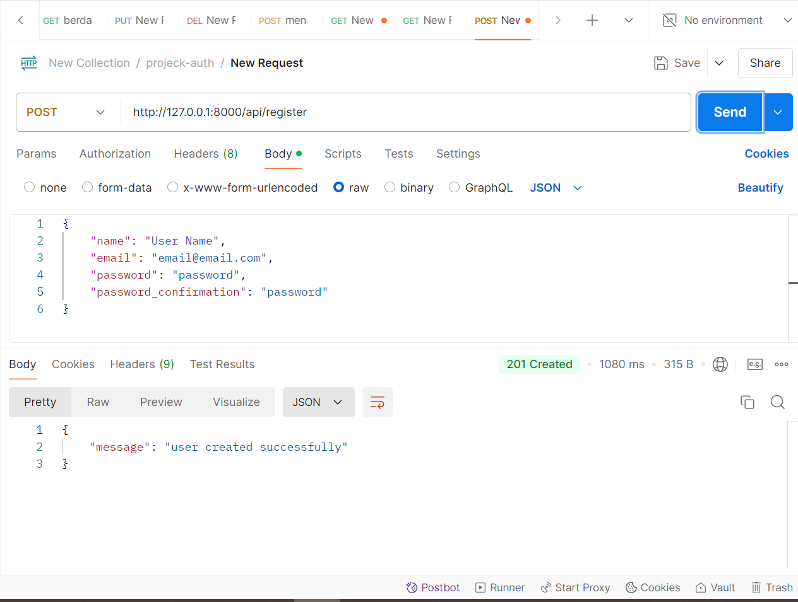
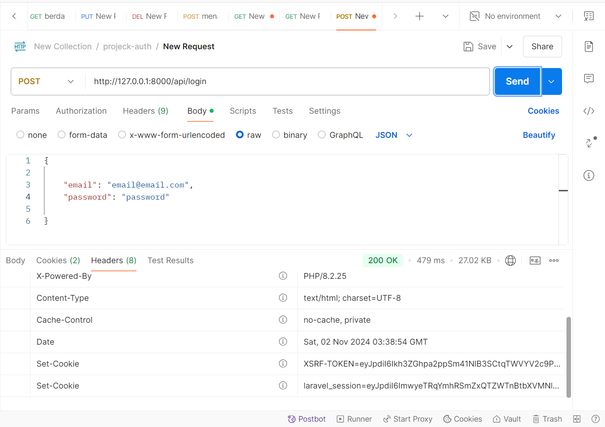
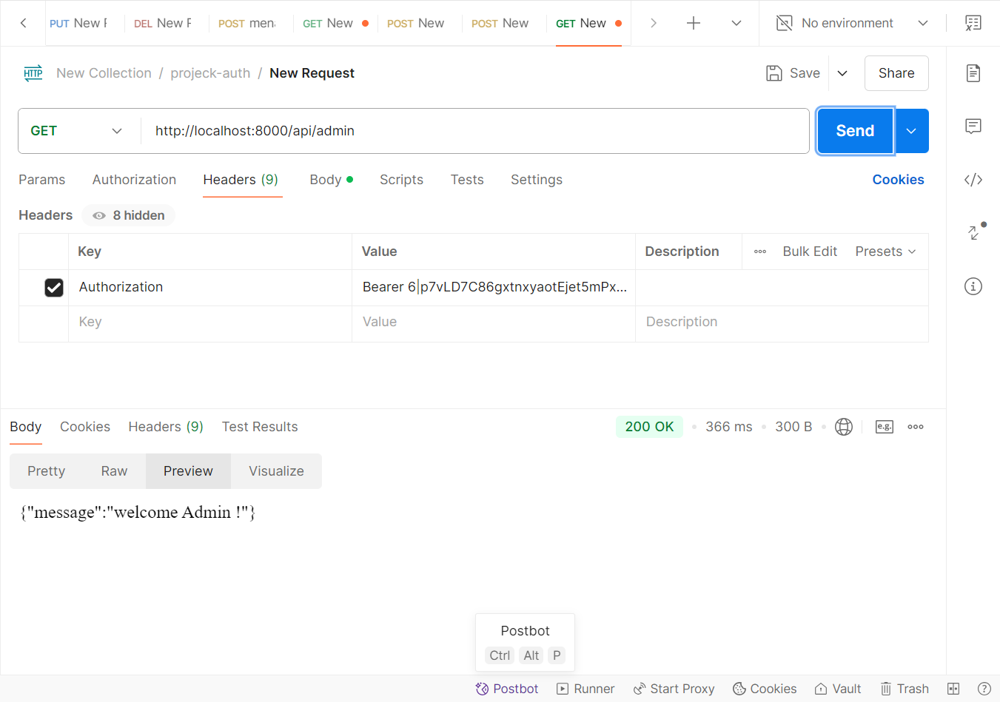
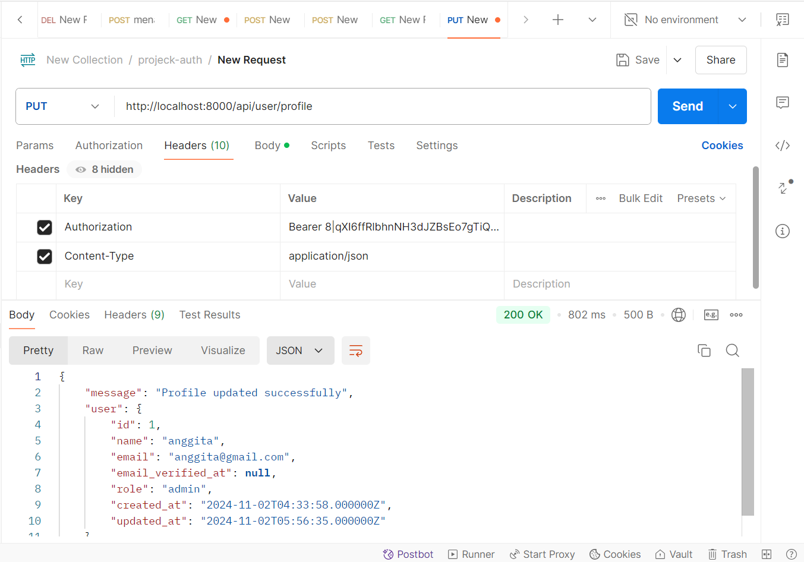
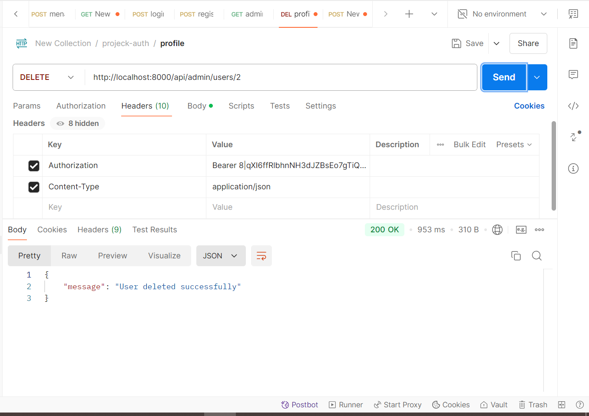
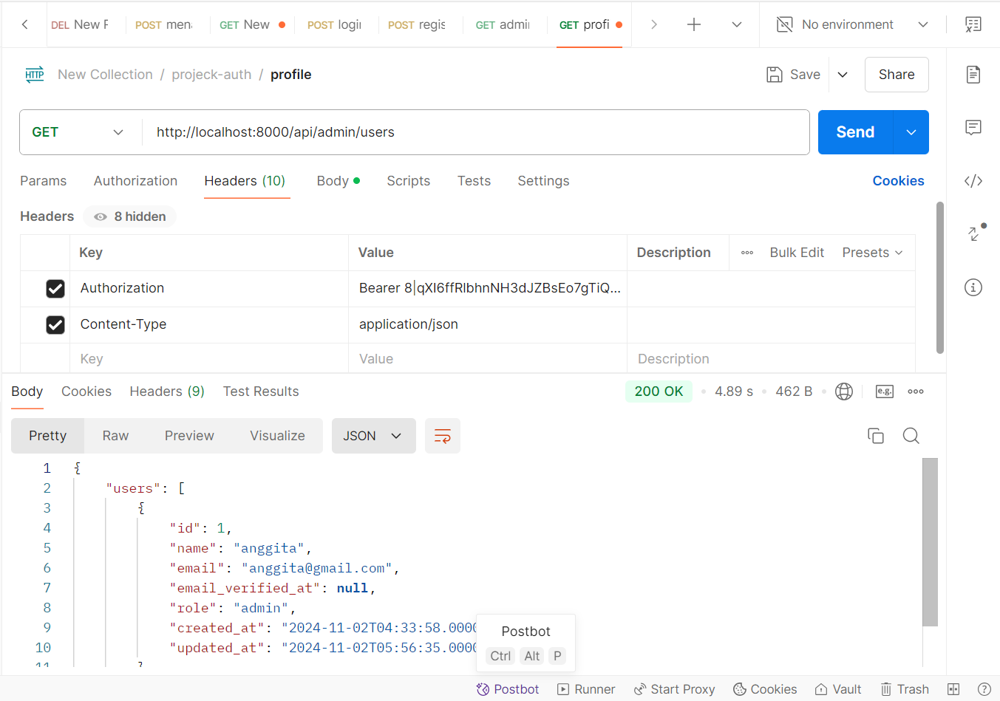

Praktikum :
1.register

2.login

3.admin

Tugas Praktikum
1.mengubah fitur untuk memperbarui profil pengguna

2.Implementasi sistem untuk delete pengguna dengan otorisasi admin

3.Buat API untuk mengambil daftar semua pengguna (hanya bisa diakses oleh admin).

